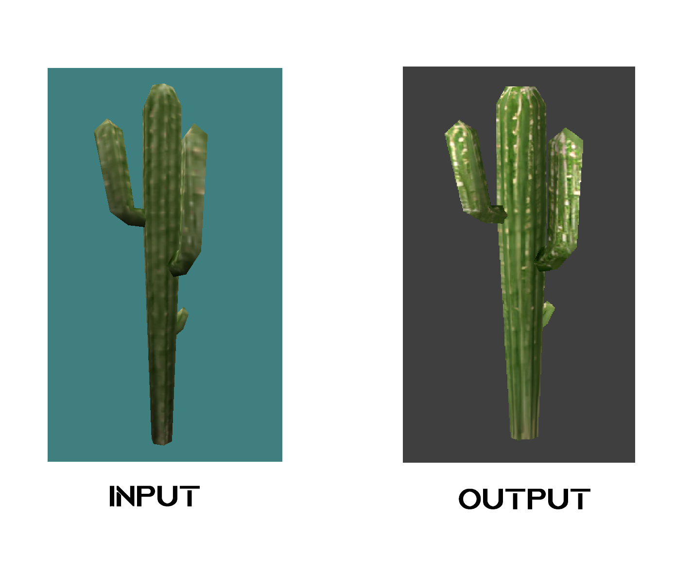
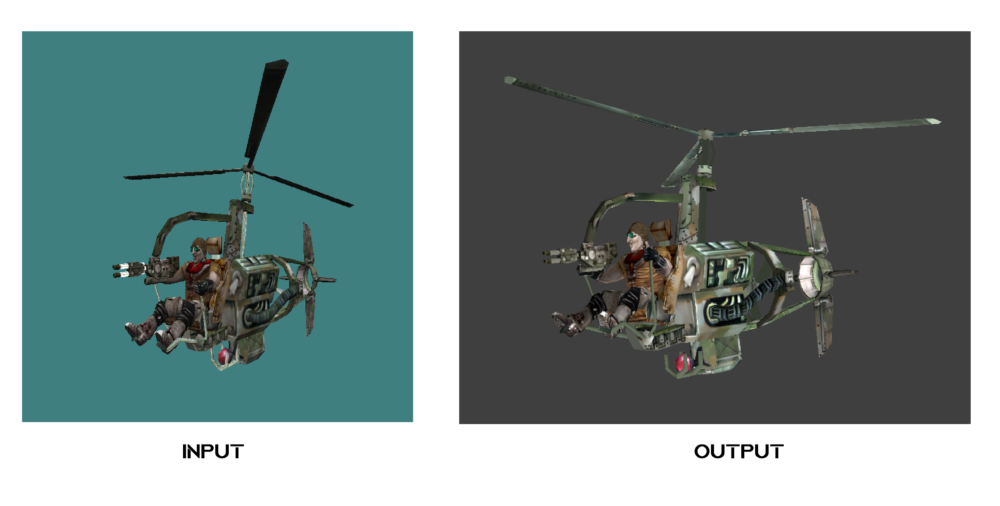
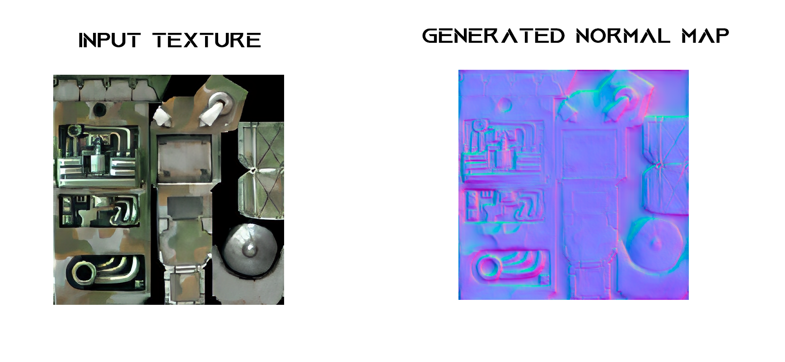

# G2SConverter
Convert models from GoldSource engine to Source engine with AI

### Description

This utility convertts GoldSource engline models to Source engine models. A feature of this utility is the ability to improve the quality of textures of models using Upscaling, debluring and normal map genrating.
All operations to improve the quality of textures are performed by neural networks.

## Result examples







## Operations with textires

### Upscaling and debluring

To improve the quality of the texture, it is first Upscaled using RealESRGAN. The user can select scaling factor: x2, x4 or x8. After the Upscaling procedure, the texture is deblured using the Scale-recurrent Network for Deep Image Deblurring. An example of a processed texture is shown in the following image (parameters used: scaling-factor = 4 and deblur iterations = 4)


### Normal maps generation

besides upscaling and debluring the utility also generates normal maps for each texture. This is implemented using the DeepBump by HugoTiny model. Examples of normal maps are shown in the following images.



## Usement 

### Step 1: Install required libraries

```
pip install requirements.txt
pip install opencv-contrib-python
```

or 

```
pip install imageio==2.14.0
pip install numpy==1.22.1
pip install onnx==1.10.2
pip install onnxoptimizer==0.2.6
pip install onnxruntime==1.10.0
pip install opencv_python_headless==3.4.17.61
pip install opencv-contrib-python
pip install Pillow==9.0.1
pip install scikit_image==0.19.1
pip install scipy==1.7.3
pip install skimage==0.0
pip install tensorflow==2.7.0
pip install tf_slim==1.1.0
pip install torch==1.10.1


```

### Step 2: install CUDA Toolkit

This step is optional, the utility can process images using the CPU, however, in this case, the texture processing process can take an extremely long time.

So, download CUDA toolkit from https://developer.nvidia.com/cuda-toolkit and install it.

### Step 3: run the python script

```
python converter.py --input cactus.mdl  --studiomdl   "D:\\SteamLibrary\\steamapps\\common\\Team Fortress 2\\bin\\studiomdl.exe" --compiled "D:\\SteamLibrary\\steamapps\\common\\Team Fortress 2\\tf\\models\\"  --upscaling True --scaling_factor 4 --normalmaps True --deconvolution True --iterations 4
```

## Command-line arguments

| Argument | Type | Description |
| --- | --- | --- |
| `--input` | String | Patho to model file or to folder with models |
| `--studiomdl` | String | Path to *studiomdl.exe*, you can find in * common\<gamename>\<gamefolder>\bin\studiomdl.exe (italic)*  |
| `--compiled` | String | Path to the folder with models of the game whose studiomdl.exe you are usingю * common\<gamename>\<gamefolder>\models (italic)* |
| `--upscaling` | Boolean | Should the program  upscale model textures? |
| `--scaling_factor`| Integer | Upscaling scale factor. Allowed values: 2, 4, 8 |
| `--normalmaps` | Boolean | Should the program generate normal maps for textures ? |
| `--deconvolution` | Boolean | Should the program deblur textures ? |
| `--iterations` | Integer | How many deconvolution iterations should the program do? Recomended: 4-8, Max: 10 |

## Links

https://github.com/jiangsutx/SRN-Deblur - Scale-recurrent Network for Deep Image Deblurring

https://github.com/xinntao/Real-ESRGAN - RealESRGAN

https://github.com/HugoTini/DeepBump - DeepBumb by HugoTini

https://github.com/NeilJed/VTFLib - VTFLib 

Models and textures demonstrated here: Gunamn Chronicles by Rewolf Software
